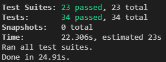

# Advisors List (React, Redux)

### Setup
Below are the steps to get it running.

1. `yarn`  Installs all the dependencies.
2. `yarn start:server`  Starts the application server.
3. `yarn start`  Starts the application.
4. `yarn test`  Run all the tests using the test command (optional step)

Once the server is up the site will be available at `http://localhost:3000/`

# Description

Design and implement React application to list all advisors and sort them based on different criteria such as whether or not an advisor is online or offline, or which languages an advisor speaks. It should also be possible to sort the list of advisors by the number of reviews he/she received.

## Requirements
- [x] Sort advisors by number of reviews
- [x] Filter advisors by status and language.
- [x]Basic testing

- [x] Nice look and feel.
- [x] Use a node.js server to serve data to the client.
- [x] Use Promise and setTimeout to simulate a delay in returning response through a network.
- [x] Unlimited scrolling of advisors when user scrolls to the bottom of the page.

#### Approach
I have created the application with create react app, and below is the pattern followed in the implementation

##### Components
- The complete app is divided in to multiple reusable components/views to maintain the code's reusability, followed the atomic design to organise components.
- I have used material UI as a base and created wrappers around the components for customisation based on the mock up.

##### Containers
- Components are wrapped with containers to get the Redux state and actions as props.

##### Actions
- Actions are plain javascript objects with TYPE property in it, actions will be dispatched based on user interactions with the application.

##### Reducers
- Reducers are pure functions which will take action object as input parameters and will update the Redux state accordingly.
- I created the individual reducers for each action to follow a TDD approach and to make it more maintainable and readable.

##### Selectors
- Selectors are used to compute derived data, allowing the application to avoid unnecessary computation or re-rendering.
- Selectors are efficient. A selector is not recomputed unless one of its input arguments changes.
- Selectors can be composed and they can be used in other selectors to provide params which helps increase the maintainability.

##### Constants
- Constants are used to define the ACTION CONSTANTS AND other static data in the application.

##### Server
- Used Node and express server to serve the data to the client from the faker API

##### Testing
- Used jest and Enzyme libraries to test components, containers, actions, reducers and selectors

### Sample screens
#### Desktop view

#### Mobile view

#### Test cases snap

